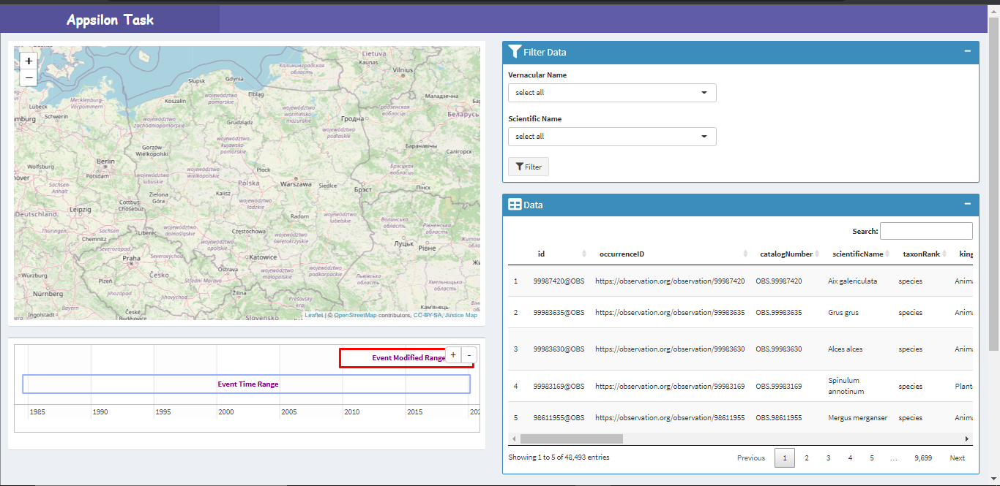
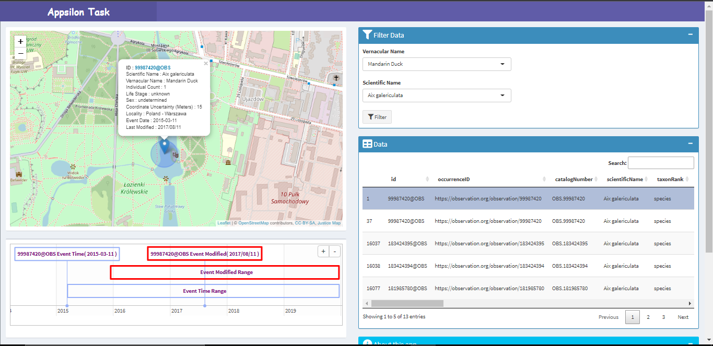

# AppsilonTask
shinyapps.io Link : https://hassan-abbas.shinyapps.io/AppsilonTask/

# Data 
The data used in this app comes from the [Global Biodiversity Information Facility](https://www.gbif.org/occurrence/search?dataset_key=8a863029-f435-446a-821e-275f4f641165). (approximately 20gb)

# Challenges
The data was very large to read in R. Dataset contains record of all countries.

So with the help of [FilteringPolandDataOnly.R](Preprocessing/FilteringPolandDataOnly.R) code read each line of the file and save record of Poland  only. After filtering i got new dataset only of Poland  [occurence_poland.csv](dataset/occurence_poland.csv).

| Dataset | Size | Description |   
| --- | --- | --- |
| occurence.csv | ≈ 20 GB | Contain records of the all the countries |
| occurence_poland.csv | ≈ 20 MB | After filtering only poland data |

# Dashboard

After selecting the Vernacular and Scientific Name data can be filtered by clicking the filter button.

Filtered data is displayed in the Data table section. Clicking any row of the table displays its observations on the map. Also displays events and modified timelines.
Clicking the pointer on the map, pop-up displays details of the selected row.

# Future Work
Right Now this app using only Poland data. But in the future can be used for global dataset.

As the dataset is given in one ( ≈ 20GB) file. Data Requires very large memory to be directly read into the app. So, by modifying a little code in [FilteringPolandDataOnly.R](Preprocessing/FilteringPolandDataOnly.R), we can create a separate .csv file for each country. In the Shiny app, another select input can be created to select a country. When every time a specific country is selected, the file (.csv) of that country will be read. In this way, we can handle this big file issue.
